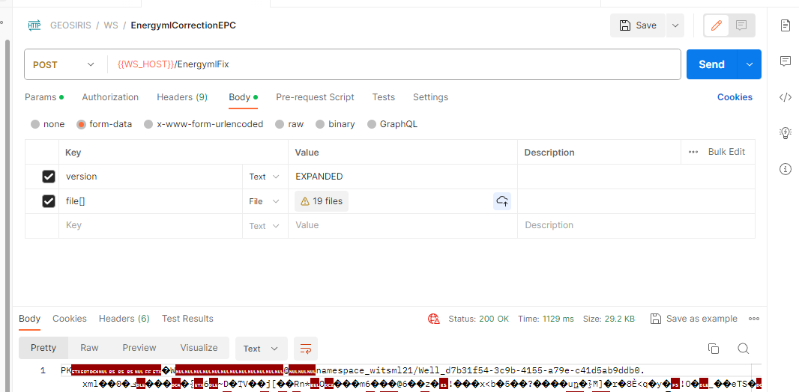

# WebStudio

[](https://sonarcloud.io/summary/new_code?id=geosiris-technologies_webstudio)

## Introduction

The WebStudio is a web application that allows to manipulate energyml file (such as EPC or individual xml files)

## Features

- Edit/create energyml (resqml/witsml/prodml) files.
- Working with [ETP](https://www.energistics.org/energistics-transfer-protocol/) servers
- Generate EPC files
- Validation of EPC file content
- Graph and tree visualisation of energyml data
- 3D data visualization

## Requirements

- Java 11
- Maven
- Tomcat 10
- Docker
- Docker-compose

## Version History

- 1.0.1:
    - Initial working Release
- 1.0.2:
    - ETP connexion bug fix
- 1.0.9:
    - Better Ui
    - Possibility to import only some element from an EPC file
    - 3D vue to visualise some elements from an ETP server. Supported elements : 
      - TriangualtedSetRepresentation
      - PolylineSetRepresentation
      - PointSetRepresentation
- 1.0.11:
    - 3D visu : 
        - *ColorInformation* in a *GraphicalInformationSet* can be used if it references an **HSV color** in a *DiscreteColorMap*

- 1.0.14:
    - REST API : 
        - A REST API has been added to be able to validate/fix EPC/xml files.
    - Bugfix : 
      - Sometimes export the EPC file was failing from the interface. It was due to specific entities that were not supported for export.
      - Witsml/Prodml objects (like **Log**) can contain as *sub-objects* other *AbstractObject*. They are now detected during validation/auto-correction.

## License

This project is licensed under the Apache 2.0 License - see the `LICENSE` file for details

## Support

Please enter an issue in the repo for any questions or problems.

## Run the code :

See project [webstudio-platfrom](https://github.com/geosiris-technologies/webstudio-platform)

## Compile the project:

```bash
mvn -U clean package
```

If you do not have a **settings.xml** file, please copy the **ci_settings.xml** file and replace the **${env.CI_JOB_TOKEN}** variable by your own token, and save this new file as **settings.xml**

## Related projects :

 - https://github.com/geosiris-technologies/cloud-storage-api
 - https://github.com/geosiris-technologies/energyml-java-generator
 - https://github.com/geosiris-technologies/energyml-utils
 - https://github.com/geosiris-technologies/etpproto-java
 - https://github.com/geosiris-technologies/etptypes-java

## Setting up project :

### With ini file :

The WebStudio configuration can be done with a ".ini" file. Examples are given in the "docker/" folder of this projet.
To be found by the WebStudio, you must set the environment variable **WS_CONFIG_INI_FILE_PATH** to the path of this file (inside the docker instance). 
Example in a dockerFile : 
```dockerfile
ENV WS_CONFIG_INI_FILE_PATH /config/sample-ws-config.ini
```

**User Database**

Your can parametrize the WebStudio to use or not a user database with postgresSQL.
To enable this feature, set the property **enableUserDB** to **true** in the *webstudio* section.
```ini
[webstudio]
...
enableUserDB=true
...
```


To configure the database connection you can modify the ini file (with your own values) by creating a *userdb* section : 
```ini
[userdb]
databaseType=postgres 
host=psql_demo
port=5432
login=postgres
password=pwd_ws_DEMO
hashSalt=mqgztZ1VbL4cOwFjkwbARY
```

**User Workspace persitence**

The WebStudio also allows to save the work in progress for each user. This feature allows to recover data even if the user has been disconnected.+

*Warning :* Thuis feature is only enabled if the user-database is also enabled.

To enable this feature, set the property **enableWorkspace** to **true** in the *webstudio* section.
```ini
[webstudio]
...
enableWorkspace=true
...
```

To configure the storage of the xml files, you can use an S3 bucket, Azure Blob Storage, or Google Cloud Storage.

Example for bucket s3 :
```ini
[s3]
localstackEnabled=true
; must not have underscore in the url !
localstackEndpoint=http://workspace-minio:9000 
localstackRegion=us-east-1
accessKey=minioadmin
secretKey=minioadmin
```

Example for Azure :
```ini
[azureblobstorage]
connectionString=YOUR_VALUE 
containerName=CONTAINER_NAME
```

Example for Google :
```ini
[googlecloudstorage]
keyfile=PATH_TO_YOUR_FILE 
```

### With environment variables:

All variables set in the ini file can be **overwritten** with environment variable. To set variables you must follow the naming rule : 
```
[INI_SECTION_LOWERCASE]_[VARIABLE_WITH_CASE]
```

Example for S3 Property in a docker-compose : 
```dockerfile
environment:
  webstudio_enableUserDB: true
  webstudio_enableWorkspace: true
  workspace_databaseType: s3
  s3_localstackEndpoint: http://my-workspace:9000 
  s3_accessKey: myAdminLogin
  s3_secretKey: myAdminPassword
```

## Change the https certs:

Generate the key with your password
```bash
keytool -genkey -alias tomcat -keyalg RSA -keystore sample-key.crt -storepass DemoCRT_password
```

Change the **docker/server-production.xml** to have a connector like this:

```java 
<Connector
    protocol="org.apache.coyote.http11.Http11NioProtocol"
    port="8443"
    maxThreads="150"
    SSLEnabled="true">
  <SSLHostConfig>
    <Certificate
      certificateKeystoreFile="/usr/certificates/sample-key.crt"
      certificateKeystorePassword="DemoCRT_password"
      type="RSA"
      />
    </SSLHostConfig>
</Connector>
```

## REST API

The WebStudio provides a simple REST API to validate and correct EPC/xml files.

### Validation : "/EnergymlValidation"

A post request on the endpoint "/EnergymlValidation" with files inside "form-data" will return a json file containing information about the correctness of your xml/epc files.

The messages help you with a dotted notation for each error. Example : *".ChanelSet.O.Channel.1"* means the 2nd Channel xml element in the 1st sub xml element "ChannelSet".

Example with postman : 


### Correction : "/EnergymlFix"

A post request on the endpoint "/EnergymlFix" with files inside "form-data" will return an EPC file containing all of your xml files (even taken from an input EPC file), and also a log file that describes the modifications done to correct your entities.

For now the only correction done is on DOR information. If an object refers to an other one with its UUID, the *Title* and the *QualifiedType*/*ContentType* are verified and eventually fixed.

**Export version:** The resulting EPC can follow the old file naming convention "/[ENERGYML_TYPE]\_[UUID].xml" but also the new one : "/[PACKAGE][PACKAGE\_VERSION]/[ENERGYML\_TYPE]_[UUID].xml". The new version is obtainable by sending a parameter called "version" with the value **EXPANDED** (uppercase).

Example with postman : 
